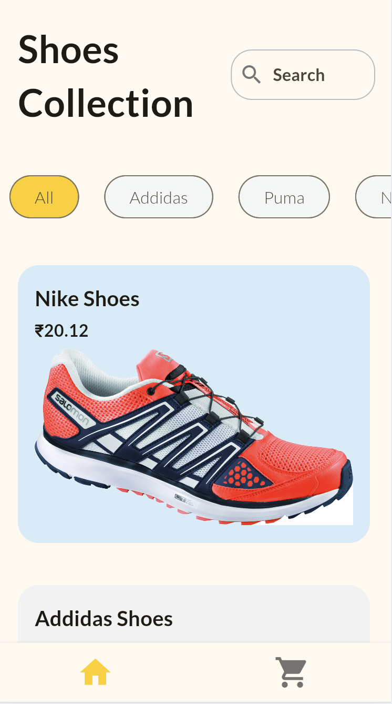

# Shop App Flutter 🛍️

A responsive and attractive shoes shopping app built with Flutter. This app provides a sleek user interface optimized for both mobile and web platforms, allowing users to browse, filter, and purchase shoes effortlessly.

---

<p align="center">
  
  <a href="https://github.com/JaiminPatel02/shopping_flutter_app/blob/main/ui.mp4" target="_blank">
    
  </a>
</p>

*Click the play icon to view the app demo video.*

---

## Features 📱

- **Responsive Design**: Fully optimized for various screen sizes, ensuring a seamless experience on mobile and desktop.
- **Attractive UI**: Modern and clean design focusing on user experience and easy navigation.
- **Shopping Features**:
  - Browse and filter shoes by brand, price, and category
  - Add items to cart and proceed to checkout
  - View product details, reviews, and ratings
- **Fast & Fluid**: Built with Flutter for high performance across platforms.

## Getting Started 🚀

To try out this app on your local machine:

1. Clone this repository:
   ```bash
   git clone https://github.com/yourusername/shop_app_flutter.git
